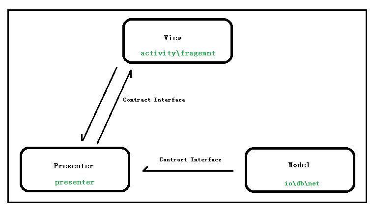

# MVPKotlin

> 快捷、高效、低耦合的Android MVP架构。

扫码体验：

* [目录](#)
	* [集成方式](#res1)
	* [概述](#res2)
	* [代码示例](#res3)
		* [Contract接口](#res3_1)
		* [View层](#res3_2)
		* [Presenter层](#res3_3)
		* [网络请求](#res3_4)
		* [数据库操作](#res3_5)
	* [Kotlin MVP Auto 插件](#res4)
	* [截图](#res5)

## 
集成方式

> * 1、Project的**build.gradle**文件添加如下代码：

	allprojects {
	    repositories {
	      	...
	        maven { url 'https://jitpack.io' }
	    }
	}

> * 2、主Module的**build.gradle**添加依赖：

    //mvp core
    implementation 'com.github.cn-ljb:kotlin-mvp-lib:1.0.0'
    //net lib
    implementation 'com.github.cn-ljb:net-lib:1.0.0'
    //dao lib
    implementation 'com.github.cn-ljb:dao-lib:1.0.0'

lib源码：[kotlin-mvp-lib](https://github.com/cn-ljb/kotlin-mvp-lib)、[net-lib](https://github.com/cn-ljb/net-lib)、[dao-lib](https://github.com/cn-ljb/dao-lib)

## 
概述

> **为什么要使用MVP架构？**

通常一般的Android项目结构，我们会在Activity\Fragment中编写大量代码，例如：网络请求、数据填充、页面切换等等，这种项目结构宏观的称之为MVC。

**MVC**：我们可以把数据源（网络请求、IO...）看作Model层，xml等布局文件看作View层，Activity\Fragment看作Controller层。但在android中xml能力太薄弱了，以至于Activity做了很多本不属于它的工作。

**MVP**：在MVP架构中Model层与MVC一样作为数据源，不过将Activity\Fragment都看作为View层的一部分负责数据的展示和填充，将Model层与View层的关联操作交给了Presenter层。

> **该项目架构**

> 特点：
> 
> * 1、V层仅由Activity和Fragmen组成，且仅负责View交互和数据填充工作；
> * 2、M层完全与V层隔离，P层作为V层与M层的桥梁，承担中间人角色（V通过P获取M数据）；
> * 3、V层与P层相互持有，通过Constract限制两者的访问域降低耦合；
> * 4、P层通过Factory产出M层Protocol的接口引用降低耦合；
> * 5、Factory产出的M层Protocol是可复用，且内存安全的。

## 
代码示例

> * **
Contract接口
**
>
> 内部定义IView、IPresenter小接口分别继承IViewContract、IPresenterContract.

	interface LoginContract {
	
	    interface IView : IViewContract {
	   		...
	    }
	
	    interface IPresenter : IPresenterContract {
	        fun login()
	        ...
	    }
	}

> * **
View层
**
>
> Activity\Fragment继承BaseMvpXxx，在泛型中关联P层约束接口，并实现V层约束接口。

	class LoginActivity : BaseMvpActivity<LoginContract.IPresenter>(), LoginContract.IView {
		
	    override fun registerPresenter() = LoginPresenter::class.java
	
	    private fun login() {
	        getPresenter().login()
	    }
		...
	}	

> * **
Presenter层
**
>
> Presenter继承BaseMvpPresenter，在泛型中关联V层约束接口，并实现P层约束接口。

	class LoginPresenter : BaseMvpPresenter<LoginContract.IView>(), LoginContract.IPresenter {
	
	    override fun login() {
	        ...
	    }
	}

> * **
网络请求
**
> 
> 1、使用网络库前，需要先进行初始化，建议放到Application中进行；
> 
> 2、编写HttpProtocol接口；
> 
> 3、从HttpFactory中产出HttpProtocol实例。
	
	/**
	 * 1、初始化网络库
	 * @param1: 接口base url
	 * @param2: 公共header
	 * @param3: 公共参数
	 * @param4: 是否输出日志
	 * */
	HttpConfig.init(HTTP_API_DOMAIN, headerMap, paramMap, isLog)

>
	
	
	/**
	 * 2、编写HttpProtocol接口
	 * */
	interface IUserHttpProtocol {
	    /**
	     * 通过用户名获取用户信息
	     * @param userName 用户名
	     * @return  用户基本信息
	     * */
	    @GET("/users/{userName}")
	    fun getUserInfoByName(@Path("userName") userName: String): Observable<User>
		
		...
	}

>

	/**
	 * 3、从HttpFactory中产出HttpProtocol实例 
	 * */
    HttpFactory.getProtocol(IUserHttpProtocol::class.java)
            .getUserInfoByName(userName)
            .compose(RxUtils.bindToLifecycle(getMvpView()))
            .subscribeOn(Schedulers.io())
            .observeOn(AndroidSchedulers.mainThread())
            .subscribe()

 是不是很眼熟？该网络库内部是通过 okhttp + retrofit + rxjava 实现。

> * **
数据库操作
**
> 
> 1、使用数据库前，需要先进行初始化，建议放到Application中进行；
> 
> 2、继承BaseTable编写Table类；
> 
> 3、编写DaoProtocol接口；
> 
> 4、编写DaoProtocol接口实现类；
> 
> 5、关联DaoProtocol接口与DaoProtocol接口实现类；
> 
> 6、从DaoFactory中产出DaoProtocol实例。

	
	/**
	 * 1、初始化数据库
	 * @param1 数据库OpenHelper辅助类（详见项目代码）
	 * @param2 DaoProtocol关联类
	 * */
	DaoConfig.init(dbHelper, protocolConfig)

>

	/**
	 * 2、继承BaseTable编写Table类
	 * 实现createTableName() 和 createColumns()
	 * Time:2019/4/20
	 * There is a lot of misery in life
	 **/
	class UserTable : BaseTable() {
	
	    val COLUMN_ID = BaseColumns._ID
	    val COLUMN_USER_ID = "user_id"
	    val COLUMN_AVATAR_URL = "avatar_url"
	    val COLUMN_NAME = "name"
		...
	
		/**
		 * 返回表名
		 */
	    override fun createTableName() = "tb_user"
	
		/**
		 * 返回表字段
		 */
	    override fun createColumns(): Map<String, String> {
	        val tableColumns = HashMap<String, String>()
	        tableColumns[COLUMN_ID] = "integer primary key autoincrement"
	        tableColumns[COLUMN_USER_ID] = TYPE_TEXT
	        tableColumns[COLUMN_AVATAR_URL] = TYPE_TEXT
	        tableColumns[COLUMN_NAME] = TYPE_TEXT
	        ...
	        return tableColumns
	    }	
	}

>

	/**
	 * 3、编写DaoProtocol接口
	 **/
	interface IUserDaoProtocol : IDaoInterface {
	   
	    /**
	     * 保存用户
	     * */
	    fun saveUser(table: UserTable, user: User): Observable<Boolean>
	}	

>

	/**
	 * 4、编写DaoProtocol接口实现类
	 **/
	class UserDaoProtocol : BaseDaoProtocol(), IUserDaoProtocol {
	
	   
	    override fun saveUser(table: UserTable, user: User): Observable<Boolean> = createObservable {
	        saveUserImpl(table, user)
	    }
	
	    private fun saveUserImpl(table: UserTable, user: User): Boolean {
	       ...
	    }
	}

>

	/**
	 * 5、关联DaoProtocol接口与DaoProtocol接口实现类
	 **/
	class ProtocolConfig : IDaoProtocolConfig {
	
	    @Suppress("UNCHECKED_CAST", "IMPLICIT_CAST_TO_ANY")
	    override fun <T> transformProtocol(clazz: Class<T>) = when (clazz) {
	        IUserDaoProtocol::class.java -> UserDaoProtocol()
			...
	        else -> throw IllegalStateException("not found dao interface object  : ${clazz.name}")
	    } as T

	}

>

	/**
	 * 6、从DaoFactory中产出DaoProtocol实例
	 **/
	DaoFactory.getProtocol(IUserDaoProtocol::class.java)
			.saveUser(mUserTable, user)
	        .compose(RxUtils.bindToLifecycle(getMvpView()))
	        .subscribeOn(Schedulers.io())
	        .observeOn(AndroidSchedulers.mainThread())
	        .subscribe()
		
## 
Kotlin MVP Auto 插件

头晕？[Kotlin MVP Auto插件](https://github.com/cn-ljb/kotlin-mvp-plugin "Kotlin MVP Auto")帮你统统搞定。

> * 自动生成Contract、View、Presenter文件
>
> 操作：包目录右键->New MVP->输入模块名称->OK

后续功能开发中...

## 
截图：

